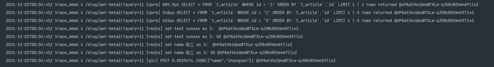

# 通过context包实现全链路日志追踪demo
## 背景
golang不像java那样支持TLS（Thread Local Storage），且golang不对外暴露goroutine id
## 实现
- 通过context包将某次请求中的所有goroutine关联起来，能标识出本次请求的完整链路，经过了哪些组件，做了什么操作。  
- 本demo使用到了web开发中常用的gin、gorm、go-redis等组件  
- 日志格式： 时间 项目名 日志等级 访问的URI [组件名] 内容  @客户端id-本次trace_id  
*日志格式较简陋，可以按需修改，也可以更改日志的输出writer，比如改为syslog、远程writer等*

## 演示
```
curl 127.0.0.1:8080/blog/get-detail?query=11 -d '{"name","zhangsan"}' -H 'Content-Type:application/json' -X POST
```

## 结果

